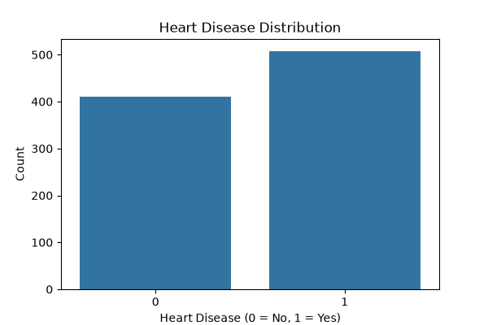
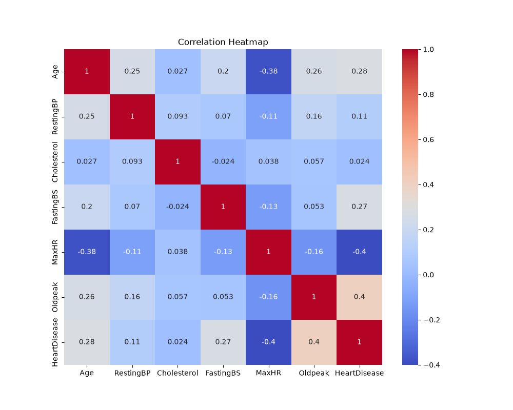
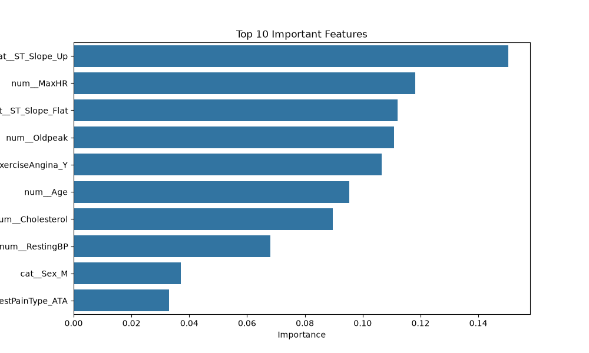
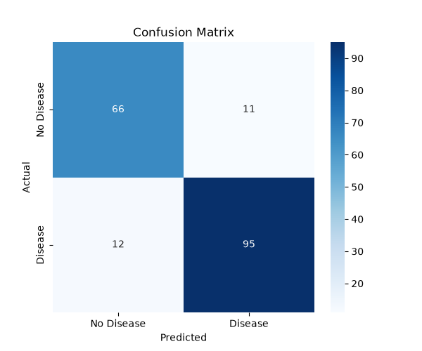

# Heart Disease Prediction using Machine Learning

<p align="center">
  
  
  
</p>

---

## Problem Statement

Heart disease is one of the leading causes of death worldwide. Early prediction can help identify high-risk patients and support timely medical intervention.

The objective of this project is to build a Machine Learning model that predicts whether a patient is likely to have heart disease based on medical attributes. The project demonstrates a complete machine learning workflow, from data preprocessing to model evaluation.

---

## Dataset

This project uses the **Heart Failure Prediction Dataset**.

| Property | Value |
|----------|-------|
| Dataset | Heart Failure Prediction Dataset |
| Records | 918 |
| Features | 11 |
| Target Variable | HeartDisease |
| Problem Type | Binary Classification |

The dataset contains patient information such as age, sex, chest pain type, blood pressure, cholesterol level, ECG results, maximum heart rate, exercise-induced angina, ST slope, and other clinical measurements.

---

## Technologies Used

- Python
- Pandas
- NumPy
- Matplotlib
- Seaborn
- Scikit-Learn
- Joblib
- Jupyter Notebook

---

## Methodology

The project follows the standard machine learning pipeline:

```text
Dataset
   │
   ▼
Data Cleaning
   │
   ▼
Exploratory Data Analysis
   │
   ▼
Feature Engineering
   │
   ▼
Data Preprocessing
   │
   ▼
Train-Test Split
   │
   ▼
Random Forest Classifier
   │
   ▼
Model Evaluation
   │
   ▼
Model Saving
```

The preprocessing pipeline includes:

- Handling invalid cholesterol values
- Standardization of numerical features
- One-Hot Encoding of categorical features
- Training using Random Forest Classifier

---

## Results

The trained model successfully predicts the presence of heart disease using patient medical data.

The project generates the following outputs:

- Heart Disease Distribution
- Correlation Heatmap
- Feature Importance
- Confusion Matrix
- Trained Machine Learning Model

### Heart Disease Distribution

<p align="center">

</p>

### Correlation Heatmap

<p align="center">

</p>

### Feature Importance

<p align="center">

</p>

### Confusion Matrix

<p align="center">

</p>

---

## Project Structure

```text
Heart-Disease-Prediction/
│
├── data/
│   └── heart.csv
│
├── model/
│   └── random_forest_model.pkl
│
├── notebook/
│   └── heart_disease_analysis.ipynb
│
├── results/
│   ├── heart_disease_distribution.png
│   ├── correlation_heatmap.png
│   ├── feature_importance.png
│   └── confusion_matrix.png
│
├── requirements.txt
├── README.md
└── .gitignore
```

---

## Conclusion

This project demonstrates the complete implementation of a machine learning model for heart disease prediction. It includes data preprocessing, exploratory data analysis, feature engineering, model training, evaluation, and model serialization.

The Random Forest Classifier provides reliable predictions on the given dataset and demonstrates how machine learning techniques can be applied to healthcare prediction problems.

---

## Author

Agastya Verma

GitHub: https://github.com/AgastyaSama

